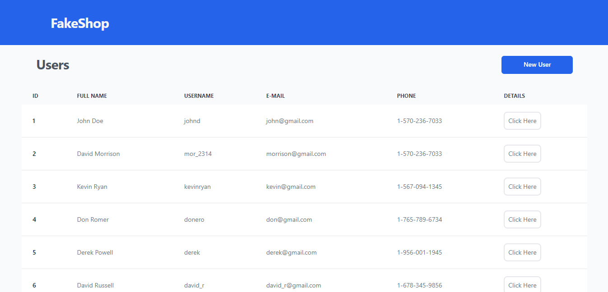
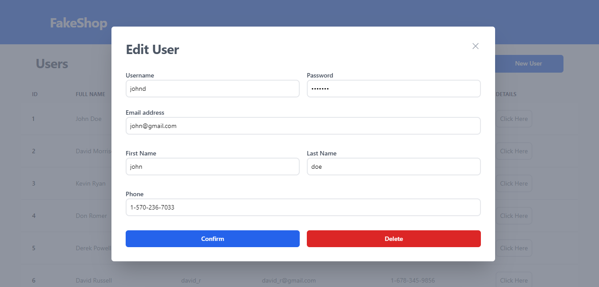

# FakeShop Frontend

## 💻 About the project
This is a React application that implements some services and libraries like Redux for state management and FakeStoreAPI for Requests Simulation.

---
## ⚙️ Functionalities
- [X] the user can see a list of all users registered, fetched via API.
- [X] the user can create a new User.
- [X] the user can edit an existing User.
- [X] the user can delete an existing User.

## 🎨 Layout

### Web

<p align="center" style="display: flex; align-items: flex-start; justify-content: center;">
  

  
</p>

---

## 🚀 How to execute the project

### Prerequisites

Before starting, you will need to have the following tools installed on your machine:
[Git](https://git-scm.com), [Node.js](https://nodejs.org/en/). 
Also it's nice to have an editor to work with the code like [VSCode](https://code.visualstudio.com/).

#### 🎲 Executing the Project
```bash
# Clone this repository
$ git clone git@github.com:edufvicentini/fakeshop-create-user-frontend.git

# Access the folder in terminal
$ cd fakeshop-create-user-frontend

# Install the dependencies
$ npm install

# Execute the application in developer mode
$ npm run dev

# The server will start in port:5173 - access <http://localhost:5173>
```

---

### 🛠 Technologies

The following tools were used in building the project:

- **[Vite](https://vitejs.dev/)**
- **[React](https://pt-br.reactjs.org/)**
- **[TypeScript](https://www.typescriptlang.org/)**
- **[Redux](https://redux.js.org/)**
- **[Redux Toolkit](https://redux-toolkit.js.org/)**
- **[TailwindCSS](https://tailwindcss.com/)**
- **[FakeStoreAPI](https://fakestoreapi.com/)**
 
> See the file [package.json](https://github.com/edufvicentini/fakeshop-create-user-frontend/blob/master/package.json)

## ⚙️ Future Features
- [ ] Typing validations for the registration form.
- [ ] Responsive design for smartphones

---

## Author

<a href="https://https://www.linkedin.com/in/eduardofvicentini">
 
 <br />
 <sub><b>Eduardo Frota Vicentini</b></sub></a> <a href="https://https://www.linkedin.com/in/eduardofvicentini" title="Eduardo">🚀</a>

Made with ❤️ by Eduardo Frota Vicentini 👋🏽 Contact me!

[](https://www.linkedin.com/in/eduardofvicentini/) 
[](mailto:tgmarinho@gmail.com)
